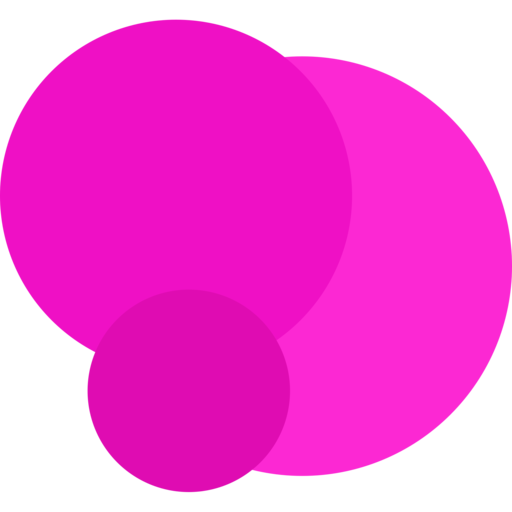

   
	
   
   
  

    
    
    
    
    
  

# Mero Website

Welcome to the repository for the Mero Website - a React project implementing Web3 which allows users to interract with the Mero Protocol.  
If you are interested in contributing, please check out our [Contribution Guide](https://github.com/merofinance/webapp/blob/master/.github/CONTRIBUTING.md)

## Development

Dependencies:

- [Install Node.js](https://nodejs.org/en/download/)
- [Install Yarn](https://classic.yarnpkg.com/en/docs/install/)

To run the app locally:

- [Clone the Repository](https://www.google.com/search?q=how+to+clone+a+repository+from+github) to your local machine
- [Open a Terminal](https://www.google.com/search?q=how+to+open+a+terminal+in+a+directory&oq=how+to+open+a+terminal+in+a+directory) at the app directory
- [Change directory](https://www.google.com/search?q=how+to+cd+to+a+directory&oq=how+to+cd+to+a+directory) to the `webapp` directory
- Run `yarn`
- Run `yarn start`
- Navigate to `http://localhost:3000/`

To launch the application using mock data, use the following command:  
`env REACT_APP_USE_MOCK=1 yarn start`

## Testing

There are two types of tests supported, Unit Tests and Automation Tests.  
Both need to be passing for any PR to be merged.

### Unit Tests

The following command can be used to run the unit tests:  
`yarn test`  
This launches the test runner in the interactive watch mode.  
See the section about [running tests](https://facebook.github.io/create-react-app/docs/running-tests) for more information.

### Automation Tests

The following command can be used to run the automation tests:  
`yarn run cy:open`  
This runs Cypress in open mode so you can view the tests suites and see them run.  
See the [Cypress docs](https://docs.cypress.io/guides/overview/why-cypress) for more information.

**Do not enter the private key of your main Ethereum wallet anywhere into Mero, Cypress, or your terminal. If you want to test using a private key, please create a new wallet that only holds Kovan ETH. No Mero employee will ever ask you for your private key and you should never share this with anyone.**

We have some specs that make calls to the Kovan testnet. For these tests we initialise a Web3 connection using a private key that is set as an environment variable. When running in the pipeline this is pulled from the GitHub secrets, but when running locally you will need to set this yourself. To set the environment variable you can use: `export CYPRESS_PRIVATE_KEY={{my_cool_private_key}}`. For the tests to pass you will need to have enough Kovan ETH on the wallet to cover the gas costs, and around 20 DAI. You can get DAI from [this faucet](https://testnet.aave.com/faucet).
